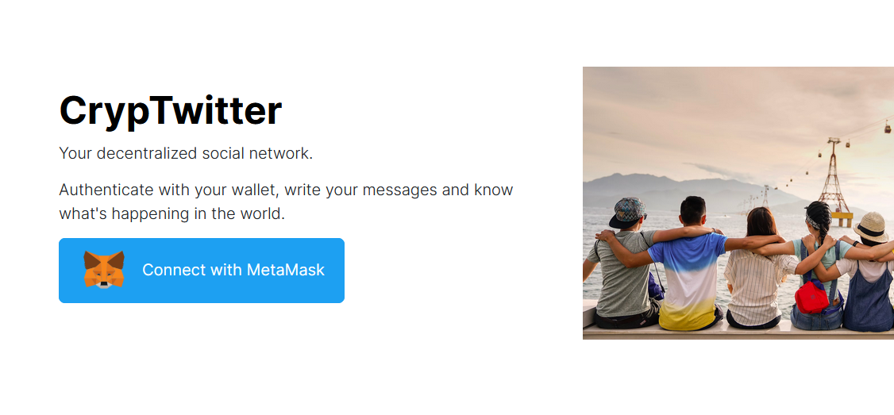
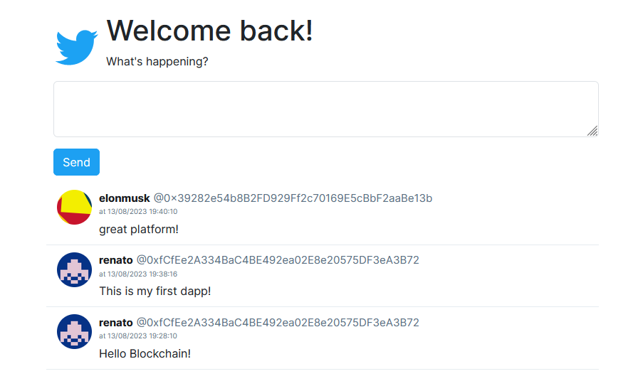

# :zap: CrypTwitter

Decentralized App developed to simulate the Web3 version of the Twitter timeline.

Smart Contract deployed and published on the Binance Smart Chain testnet. 
(Address: 0x5f8AD5A0AdA161994d7efee13E29b9f960C2B856)

Project developed during the Web3 Week: https://www.luiztools.com.br/w3w

## 🌟 Preview

## 🚀 Technologies
-  React
-  TypeScript
-  Next.js
-  Web3
-  Solidity
-  MetaMask

## 💻 How to Run the Smart Contract

1. open https://remix.ethereum.org
2. create a new CrypTwitter.sol file
3. copy and paste the content from `./smart-contract/CrypTwitter.sol`
4. compile & deploy
5. test

## 💻 How to Run the DApp interface

1. through your terminal go to `./dapp`
2. run the development server `npm run dev`
3. open [http://localhost:3000](http://localhost:3000) with your browser to see the result.
